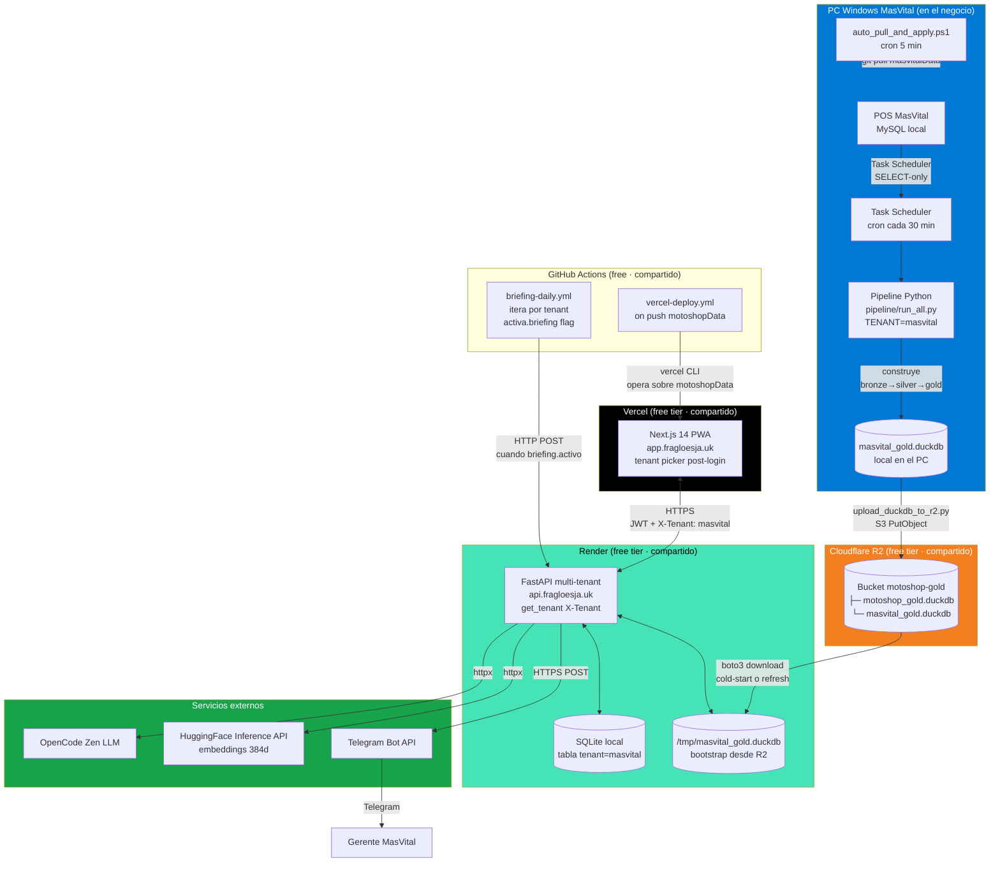
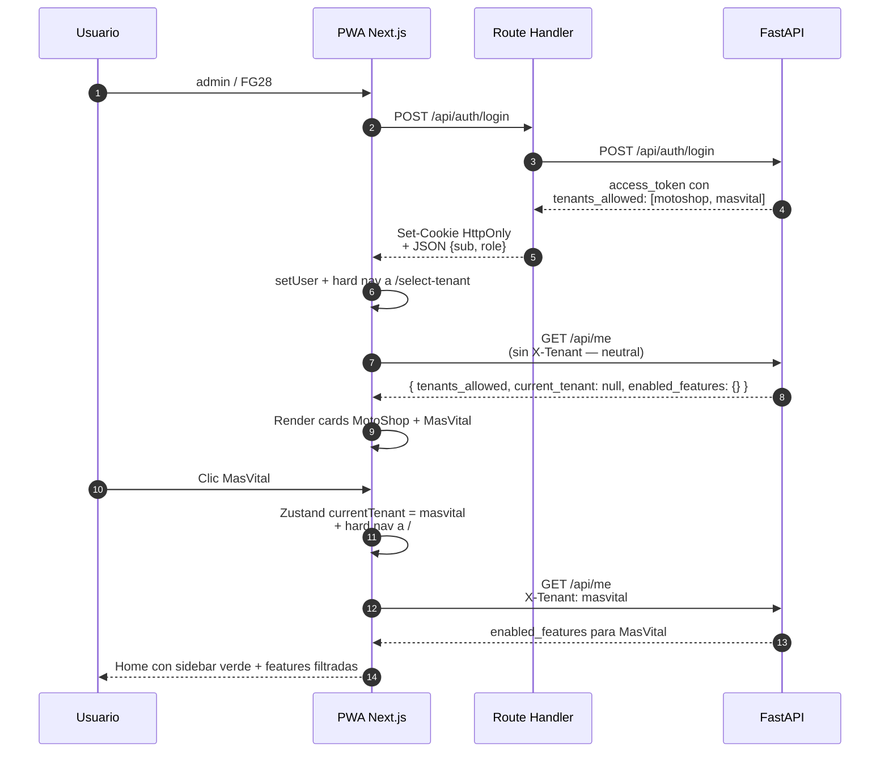
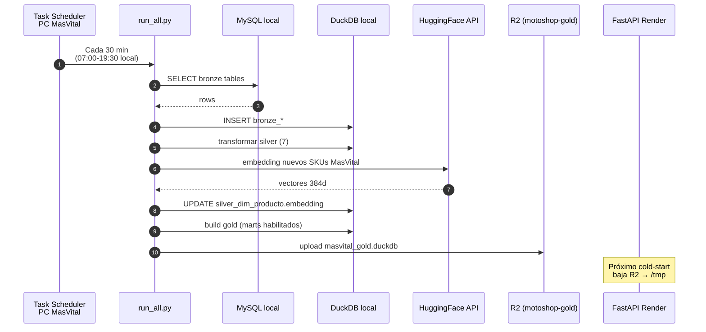
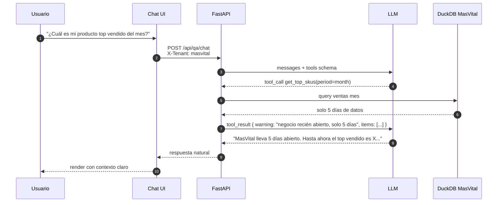

# MasVital · Plataforma de transformación digital (tenant)

> **Negocio recién abierto · Cali, Colombia.** MasVital es el segundo tenant de la plataforma `MotoShop / MasVital`. Comparte el mismo backend FastAPI, el mismo frontend Next.js PWA y la misma infraestructura $0/mes — solo cambia el origen del dato (su propio MySQL local) y un archivo DuckDB en R2 que lo identifica como tenant.

> **Documentos vivos del proyecto.** Estado al día: [`SEGUIMIENTO.md`](SEGUIMIENTO.md) · Backlog del PO: [`PENDIENTES.md`](PENDIENTES.md) · Sprint M3 (este repo): [`docs/sprint-m3-onboarding.md`](docs/sprint-m3-onboarding.md) · Plan canónico multi-tenant: [`motoshopData/docs/plan-multi-tenant.md`](https://github.com/javierportillar/motoshopData/blob/main/docs/plan-multi-tenant.md).

```
POS MasVital (Windows, MySQL local)  ───►  Pipeline ETL (DuckDB)  ───►  Cloudflare R2
                                                                              │ key: masvital_gold.duckdb
                                                                              ▼
                                                                  ┌──────────────────────┐
                                                                  │  API FastAPI         │  ←── Render free
                                                                  │  (api.fragloesja.uk) │      compartido con MotoShop
                                                                  │  X-Tenant: masvital  │
                                                                  └────────┬─────────────┘
                                                                           │
                                          ┌────────────────────────────────┼─────────────────────┐
                                          ▼                                ▼                     ▼
                                   PWA Next.js                      Bot Telegram          OpenCode Zen
                                  (Vercel free)                    (briefing diferido)      (LLM)
                                          │                        (activa @ 30 días)
                                       Gerente
```

---

## 1 · Índice

1. [Visión](#2--visión)
2. [Por qué este repo existe separado](#3--por-qué-este-repo-existe-separado)
3. [Arquitectura — vista completa](#4--arquitectura--vista-completa)
4. [Stack tecnológico](#5--stack-tecnológico)
5. [Componentes](#6--componentes)
   - [PC Windows MasVital · origen del dato](#61--pc-windows-masvital--origen-del-dato)
   - [Pipeline ETL · Bronze → Silver → Gold](#62--pipeline-etl--bronze--silver--gold)
   - [Cloudflare R2 · transporte compartido](#63--cloudflare-r2--transporte-compartido)
   - [Backend · FastAPI multi-tenant](#64--backend--fastapi-multi-tenant)
   - [Frontend · Next.js 14 PWA con tenant picker](#65--frontend--nextjs-14-pwa-con-tenant-picker)
   - [Capa IA · degradación elegante con poco histórico](#66--capa-ia--degradación-elegante-con-poco-histórico)
   - [Telegram bot · activa a los 30 días](#67--telegram-bot--activa-a-los-30-días)
   - [Auto-deploy · GitHub Actions](#68--auto-deploy--github-actions)
6. [Features habilitadas vs diferidas](#7--features-habilitadas-vs-diferidas)
7. [Modelo de datos](#8--modelo-de-datos)
8. [Catálogo de endpoints API](#9--catálogo-de-endpoints-api)
9. [Catálogo de rutas frontend (vista MasVital)](#10--catálogo-de-rutas-frontend-vista-masvital)
10. [Flujos críticos · diagramas de secuencia](#11--flujos-críticos--diagramas-de-secuencia)
11. [Deploy y operación](#12--deploy-y-operación)
12. [Cómo el costo sigue siendo $0/mes](#13--cómo-el-costo-sigue-siendo-0mes)
13. [Variables de entorno (PC MasVital)](#14--variables-de-entorno-pc-masvital)
14. [Quickstart Dev W](#15--quickstart-dev-w)
15. [Estructura de este repo](#16--estructura-de-este-repo)
16. [Roles operativos](#17--roles-operativos)
17. [Roadmap MasVital](#18--roadmap-masvital)

---

## 2 · Visión

| Antes (negocio sin sistema) | Después (con la plataforma) |
|---|---|
| Las ventas del día solo las ve el dueño desde el PC físico. | El gerente ve KPIs del día desde el celular en cualquier lugar. |
| Para saber qué hay en inventario hay que mirar bodega física o reportes manuales. | Dashboard de inventario por bodega + búsqueda híbrida (sinónimos + embeddings) del catálogo. |
| Buscar un producto requiere saber el nombre exacto. | Búsqueda inteligente: "amortiguador" encuentra "AMORTIG TRAS" aunque el nombre sea distinto. |
| No hay forma de hacer preguntas sobre el negocio sin saber SQL. | Chat con IA: "¿cuánto vendí esta semana?" responde en segundos con cero alucinación (tools tipadas). |
| El briefing diario no existe — el dueño revisa cuando puede. | A los 30 días de histórico se activa el briefing automático por Telegram a las 06:00. |

**Lo que MasVital NO hace (todavía):**

| Feature | Por qué espera | Habilita cuando |
|---|---|---|
| ABC, productos dormidos | Requiere ≥30 días de histórico para clasificación con sentido | día 30 |
| Cohortes de clientes | Requiere ≥3 meses para ver retención | día 90 |
| Forecast por categoría | Requiere ≥6 meses para que el modelo tenga señal | día 180 |
| Drift de demanda | Requiere baseline de ≥6 meses | día 180 |
| Plan de compras automatizado | Requiere forecast funcional | día 180 |

El sistema NO modifica el POS productivo de MasVital — solo lee con un usuario MySQL `api_read` SELECT-only.

---

## 3 · Por qué este repo existe separado

`masvitalData/` es el **checkout operativo del PC Windows de MasVital**, NO un fork de la plataforma. El código backend/frontend vive en [`motoshopData`](https://github.com/javierportillar/motoshopData) — este repo solo tiene lo que ese PC necesita.

| Razón | Detalle |
|---|---|
| Aislamiento operativo | El PC de MasVital es independiente del PC de MotoShop. Cada uno tiene su `.env`, su Task Scheduler, su Auto-Pull. |
| Mínimo riesgo de leak | El PC MasVital nunca ve el código backend completo ni credenciales de MotoShop. Solo lo necesario para su tenant. |
| Independencia de despliegue | Bug en pipeline MasVital no bloquea deploys de MotoShop. |
| Audit trail | Cada commit acá es operación de MasVital. Mezclar repos diluye trazabilidad. |

---

## 4 · Arquitectura — vista completa



---

## 5 · Stack tecnológico

MasVital usa **el mismo stack que MotoShop**. No hay duplicación. Detalle completo del stack en [`motoshopData/README.md`](https://github.com/javierportillar/motoshopData/blob/main/README.md#4--stack-tecnológico).

Lo único específico de MasVital es:

| Pieza | Específico de MasVital |
|---|---|
| Origen del dato | POS local del PC Windows MasVital (MySQL) |
| Object key en R2 | `masvital_gold.duckdb` |
| Path local DuckDB | `/tmp/masvital_gold.duckdb` (en Render) y `C:\...\masvital_gold.duckdb` (en el PC) |
| Header de requests | `X-Tenant: masvital` |
| Telegram chat (gerente) | A definir cuando se active el briefing |
| Features habilitadas | Subset hasta acumular histórico (ver §7) |

---

## 6 · Componentes

### 6.1 · PC Windows MasVital · origen del dato

> **Política operativa.** Todo lo del PC Windows lo opera el rol **Dev W**. El PO NO toca el PC. Dev Back tampoco — solo deja código en este repo para que Dev W lo despliegue.

**Hardware esperado.** PC Windows 10/11. Tiene el POS de MasVital instalado y su MySQL local. Recién abrió → poca data acumulada al inicio.

**Lo que vive en el PC (todo bajo la ruta acordada, ej. `C:\Users\MasVital\Documents\masvitalData`):**

| Componente | Archivo / Servicio | Función |
|---|---|---|
| Pipeline ETL | `pipeline/run_all.py` | Lee MySQL local → genera DuckDB con bronze/silver/gold. Parametrizado por `TENANT=masvital`. |
| Refresh script | `infra/refresh.ps1` | Wrapper PowerShell: corre pipeline + sube a R2. |
| Auto-pull | `infra/auto_pull_and_apply.ps1` | Cada 5 min, `git fetch + pull` si hay commits nuevos. |
| Task Scheduler | (Windows nativo) | Dispara `refresh.ps1` cada 30 min entre 07:00-19:30 hora local. |
| Backup MySQL | `infra/backup_mysql.ps1` | Snapshot diario del MySQL — protección operativa. |
| Health probe | `infra/check_health.ps1` | Verifica API arriba + datos frescos. |
| Logs | `infra/logs/refresh_*.log` | Bitácora del pipeline. |

**Usuario MySQL de lectura.** Mismo patrón que MotoShop:

```sql
CREATE USER 'api_read'@'localhost' IDENTIFIED BY '...';
GRANT SELECT ON <basededatos_masvital>.* TO 'api_read'@'localhost';
```

El POS de MasVital sigue usando su propio usuario con permisos completos. El pipeline JAMÁS escribe al MySQL productivo.

**Flujo operativo cada 30 minutos:**

```
07:00 ─┐
07:30  │
08:00  │   Task Scheduler dispara refresh.ps1
...    │   ├─ python pipeline/run_all.py
19:00  │   │  ├─ MySQL → bronze (DuckDB en memoria)
19:30 ─┘   │  ├─ bronze → silver (limpieza, business_date, dedup)
           │  └─ silver → gold (marts habilitados para MasVital)
           ├─ python scripts/upload_duckdb_to_r2.py
           │  └─ boto3 put_object → masvital_gold.duckdb en R2
           └─ Log resultado en infra/logs/
```

### 6.2 · Pipeline ETL · Bronze → Silver → Gold

Mismo pipeline genérico que MotoShop, parametrizado por env vars. Vive en `pipeline/` de este repo (lo puebla Dev Back en Sprint M3.3).

**Etapas:**

1. **bronze** — lee MySQL local de MasVital, crea tablas `bronze_*` en DuckDB. Las tablas NO llevan prefijo `masvital_` — el tenancy lo da el archivo (`masvital_gold.duckdb`).
2. **silver** — limpia, deduplica, deriva `business_date`. Calcula embeddings de productos nuevos vía HuggingFace.
3. **gold** — solo construye los marts habilitados para MasVital (ver §7). Los marts que requieren histórico (forecast, drift, cohortes) se saltan o devuelven dataframe vacío.

**Tiempo total esperado:** 1-3 min al principio (MasVital tiene pocos datos).

### 6.3 · Cloudflare R2 · transporte compartido

R2 hace el papel que en otros stacks haría S3 — pero a $0 hasta 10 GB. MotoShop + MasVital juntos usan <100 MB.

**Configuración compartida:**
- Bucket: `motoshop-gold` (el nombre quedó del primer tenant, no lo cambiamos)
- Endpoint: `https://4bd1502b7fa3f33d1d3c45ae2d252cfd.r2.cloudflarestorage.com`
- Objects: `motoshop_gold.duckdb` + `masvital_gold.duckdb`

Las credenciales R2 son las mismas para ambos PCs (compartidas). Lo único que cambia es el `R2_OBJECT_KEY` en cada `.env`.

### 6.4 · Backend · FastAPI multi-tenant

Vive en `motoshopData/motoshop-app/api/`. **No hay backend separado para MasVital.**

El backend lee el header `X-Tenant` en cada request, valida contra el claim `tenants_allowed` del JWT del usuario, y abre el archivo DuckDB correspondiente (`/tmp/masvital_gold.duckdb`). La cache key de cada query incluye el tenant para evitar cross-tenant leak.

**Endpoints relevantes:**

- `POST /api/auth/login` — admin/FG28 devuelve JWT con `tenants_allowed: [motoshop, masvital]`
- `GET /api/me` — devuelve `enabled_features` según tenant activo
- `GET /api/metrics/*` con header `X-Tenant: masvital` — sirve datos del tenant

Catálogo completo: [`motoshopData/README.md §7`](https://github.com/javierportillar/motoshopData/blob/main/README.md#7--catálogo-de-endpoints-api).

### 6.5 · Frontend · Next.js 14 PWA con tenant picker

Vive en `motoshopData/motoshop-app/web/`. **No hay frontend separado.**

**Flujo de entrada multi-tenant:**

```
┌─────────────────┐      ┌──────────────────┐      ┌─────────────────────┐
│   /login        │      │  /select-tenant  │      │   /  (home)         │
│                 │      │                  │      │                     │
│   admin / FG28  │ ───► │  Cards: 2 negs.  │ ───► │  KPIs del tenant    │
│                 │      │  Clic uno        │      │  activo + sidebar   │
└─────────────────┘      └──────────────────┘      └─────────────────────┘
```

**Página `/select-tenant`:**

```
┌────────────────────────────────────────────────────────────────┐
│  Plataforma                              [admin] [Salir]       │
├────────────────────────────────────────────────────────────────┤
│                                                                │
│           ¿Con qué negocio querés trabajar?                    │
│           Tenés acceso a 2 negocios.                           │
│                                                                │
│   ┌─────────────────────────┐  ┌─────────────────────────┐    │
│   │     [Logo MotoShop]     │  │    [Logo MasVital]      │    │
│   │      MotoShop           │  │      MasVital           │    │
│   │      Repuestos moto     │  │      (línea negocio)    │    │
│   │      Cali, Colombia     │  │      Cali, Colombia     │    │
│   │                         │  │                         │    │
│   │  ✓ 18 dashboards        │  │  ✓ 7 dashboards         │    │
│   │  ✓ Briefing diario      │  │  ⏳ Briefing: 30 días    │    │
│   │  ✓ Forecast + ABC       │  │  ⏳ Predictivos: 90 días │    │
│   │                         │  │                         │    │
│   │  [Entrar →]             │  │  [Entrar →]             │    │
│   └─────────────────────────┘  └─────────────────────────┘    │
└────────────────────────────────────────────────────────────────┘
```

**Sidebar con MasVital activo** (logo verde, features reducidas):

```
┌──────────────────┐
│ [Logo MasVital]  │ ← color brand verde
│ MasVital         │
│ [Cambiar ▾]      │ ← click → vuelve a /select-tenant sin re-login
├──────────────────┤
│ 🏠 Inicio        │
│ 📊 Dashboards   ▼│
│   ├ Ventas       │
│   └ Inventario   │ ← solo features habilitadas
│ 📦 Productos     │
│ 💬 Chat IA       │
│                  │ ← ABC, Dormidos, Cohortes, Drift, Forecast,
│                  │   Plan-compras NO aparecen en MasVital
└──────────────────┘
```

**Empty state para features no habilitadas.** Si por URL manual entrás a una ruta sin acceso (ej. `/dashboards/abc`):

```
┌────────────────────────────────────────────────┐
│  📊 ABC                                        │
├────────────────────────────────────────────────┤
│                                                │
│             🔒 No disponible aún               │
│                                                │
│   El análisis ABC requiere al menos 30 días    │
│   de histórico de ventas. MasVital lleva       │
│   solo 12 días.                                │
│                                                │
│   Se habilitará automáticamente cuando         │
│   cumplas el umbral.                           │
│                                                │
│   [← Volver al inicio]                         │
└────────────────────────────────────────────────┘
```

**Cómo el frontend identifica el tenant.** Tras escoger MasVital en el picker, Zustand guarda `currentTenant=masvital` en localStorage. El fetcher centralizado de SWR inyecta el header `X-Tenant: masvital` en TODAS las requests. El backend valida contra el claim del JWT y abre el DuckDB correcto.

### 6.6 · Capa IA · degradación elegante con poco histórico

El **chat IA con tools** funciona desde el día 1 para MasVital. Las 10 tools del LLM están parametrizadas: cuando una requiere datos que no existen, devuelve mensaje claro al modelo:

| Tool | Día 1 (MasVital) | Día 30+ |
|---|---|---|
| `get_kpis_today` | ✅ | ✅ |
| `get_top_skus(period=day)` | ✅ | ✅ |
| `get_top_skus(period=month)` | ⚠️ "Aún no hay un mes completo" | ✅ |
| `get_inventory_value` | ✅ | ✅ |
| `get_dormidos` | ⚠️ "Aún no hay productos con 90+ días" | ✅ (día 90) |
| `get_alerts_by_urgency` | ✅ | ✅ |
| `compare_periods` | ⚠️ "Necesito 2 meses para comparar" | ✅ (día 60) |
| `get_abc_distribution` | ⚠️ "Esperar 30 días" | ✅ (día 30) |
| `get_forecast_summary` | ⚠️ "Esperar 6 meses" | ✅ (día 180) |
| `get_vendedor_performance` | ✅ si hay vendedores registrados | ✅ |

El LLM redacta una respuesta natural usando las tools que sí funcionan + explica al usuario qué falta acumular.

**Embeddings** se calculan offline en cada run del pipeline (HuggingFace Inference API) para los productos nuevos. Búsqueda híbrida (sinónimos + cosine + keyword) funciona desde el día 1.

### 6.7 · Telegram bot · activa a los 30 días

Bot del proyecto: el mismo del lado MotoShop. Lo único distinto es el `TELEGRAM_GERENTE_CHAT_ID` específico de MasVital (a definir cuando el gerente de MasVital esté listo).

`briefing-daily.yml` (en `motoshopData/.github/workflows/`) itera por todos los tenants con `briefing.activo: true` en `tenants.yaml`. MasVital arranca con `activo: false`. Cuando el PO lo cambia a `true`, el cron del día siguiente manda briefing dual (uno por tenant).

### 6.8 · Auto-deploy · GitHub Actions

Reutiliza los workflows de `motoshopData`:

| Workflow | Trigger | Afecta a MasVital? |
|---|---|---|
| `briefing-daily.yml` | Cron 06:00 COL | Sí, cuando se active |
| `vercel-deploy.yml` | Push a `main` de motoshopData | Sí — el frontend es compartido |

**Auto-pull del PC MasVital** se dispara cada 5 min en el propio PC (`infra/auto_pull_and_apply.ps1`). Cuando hacés push a `masvitalData/main`, el PC aplica el cambio en menos de 5 minutos sin intervención humana.

---

## 7 · Features habilitadas vs diferidas

| Feature | Día 1 (MasVital recién abierto) | Habilita el día… | Por qué |
|---|---|---|---|
| Catálogo de productos | ✅ | día 1 | Existe desde que hay inventario inicial. |
| Stock por bodega | ✅ | día 1 | Snapshot del MySQL. |
| Ventas recientes | ✅ | día 1 | Lo que se haya facturado. |
| Dashboard ventas diarias | ✅ | día 1 | Aunque sean pocos días. |
| Dashboard inventario | ✅ | día 1 | Valor + por bodega. |
| Búsqueda híbrida | ✅ | día 1 | Embeddings se calculan en el primer pipeline. |
| Chat IA con tools | ✅ | día 1 | Tools sin datos devuelven mensaje claro. |
| Pipeline observability | ✅ | día 1 | Solo verifica que el pipeline corra. |
| ABC | ⏳ | día 30 | Necesita base mensual para clasificar. |
| Productos dormidos | ⏳ | día 90 | Definición = sin venta hace ≥90 días. |
| Cohortes clientes | ⏳ | día 90 | Mes a mes para ver retención. |
| Briefing Telegram | ⏳ | día 30 | Hay que tener KPIs interesantes para reportar. |
| Drift de demanda | ⏳ | día 180 | Necesita baseline estable. |
| Forecast categoría | ⏳ | día 180 | Modelo necesita señal. |
| Plan de compras | ⏳ | día 180 | Depende de forecast. |

Para habilitar una feature, el PO edita `tenants.yaml` en `motoshopData` y agrega el feature ID a `enabled_features` del tenant `masvital`. Auto-deploy hace el resto.

---

## 8 · Modelo de datos

Mismo modelo medallion que MotoShop. El archivo `masvital_gold.duckdb` tiene la **misma estructura de tablas** (sin prefijo de tenant — el tenancy lo da el archivo).

### Bronze (réplica cruda de MySQL MasVital)

Generadas en runtime, no se persisten en R2:

| Tabla bronze | Origen MySQL MasVital |
|---|---|
| `bronze_productos` | tabla de productos del POS |
| `bronze_bodegas` | tabla de bodegas |
| `bronze_faccompras` / `_detfcompras` | cabecera + detalle compras |
| `bronze_facventas` / `_detfventas` | cabecera + detalle ventas |
| `bronze_auxinventario` | snapshot stock por bodega |

Si el POS de MasVital usa nombres de tabla distintos a sgHermes, el mapeo se documenta en `docs/ADRs/ADR-001-mapeo-pos-masvital.md` (lo escribe Dev Back en Sprint M3.4 con el snapshot que Dev W genera).

### Silver (limpio, deduplicado, derivado)

7 tablas idénticas en estructura a MotoShop:

| Tabla | Granularidad |
|---|---|
| `silver_dim_producto` | cod_producto único + embedding |
| `silver_dim_bodega` | cod_bodega + nom_bodega |
| `silver_fact_ventas` | cabecera de factura |
| `silver_fact_ventas_detalle` | línea (SKU + cantidad + business_date) |
| `silver_fact_compras` / `_detalle` | compras al proveedor |
| `silver_fact_inventario` | snapshot stock |

### Gold (marts que MasVital sirve)

Día 1, el archivo `masvital_gold.duckdb` solo tiene los marts habilitados:

| Mart | Día 1 | Habilita |
|---|---|---|
| `gold_mart_ventas_diarias_sku` | ✅ | — |
| `gold_mart_inventario_actual` | ✅ | — |
| `gold_alertas_quiebre` | ✅ | — |
| `gold_mart_rotacion_abc` | ⏳ | día 30 |
| `gold_mart_productos_dormidos` | ⏳ | día 90 |
| `gold_mart_cohortes_clientes` | ⏳ | día 90 |
| `gold_alertas_drift` | ⏳ | día 180 |
| `gold_forecast_categoria` | ⏳ | día 180 |
| `gold_mart_abc_xyz` | ⏳ | día 180 |
| `gold_mart_rotacion_promedio` | ⏳ | día 90 |

---

## 9 · Catálogo de endpoints API

Idéntico al de MotoShop. Todos los endpoints aceptan `X-Tenant: masvital` y sirven datos del tenant.

Para los endpoints que aún no tienen datos (porque el feature está diferido), la respuesta es un payload bien estructurado con totales = 0 o lista vacía, NO un 500. El frontend ya está preparado para mostrar empty state en esos casos.

Catálogo completo: [`motoshopData/README.md §7`](https://github.com/javierportillar/motoshopData/blob/main/README.md#7--catálogo-de-endpoints-api).

---

## 10 · Catálogo de rutas frontend (vista MasVital)

Cuando el usuario tiene tenant activo = `masvital`, el sidebar muestra solo las rutas con feature habilitado:

| Ruta | Día 1 (MasVital) | Día 30 | Día 90 | Día 180 |
|---|---|---|---|---|
| `/` (home) | ✅ | ✅ | ✅ | ✅ |
| `/dashboards/ventas` | ✅ | ✅ | ✅ | ✅ |
| `/dashboards/inventario` | ✅ | ✅ | ✅ | ✅ |
| `/dashboards/abc` | 🔒 | ✅ | ✅ | ✅ |
| `/dashboards/dormidos` | 🔒 | 🔒 | ✅ | ✅ |
| `/cohortes` | 🔒 | 🔒 | ✅ | ✅ |
| `/drift` | 🔒 | 🔒 | 🔒 | ✅ |
| `/forecast` | 🔒 | 🔒 | 🔒 | ✅ |
| `/plan-compras` | 🔒 | 🔒 | 🔒 | ✅ |
| `/alerts` | ✅ | ✅ | ✅ | ✅ |
| `/chat` | ✅ | ✅ | ✅ | ✅ |
| `/products` + `/products/[sku]` | ✅ | ✅ | ✅ | ✅ |
| `/admin/pipeline` | ✅ | ✅ | ✅ | ✅ |
| `/profile` | ✅ | ✅ | ✅ | ✅ |

🔒 = ruta oculta del sidebar + empty state "No disponible aún" si se accede por URL manual.

---

## 11 · Flujos críticos · diagramas de secuencia

### 11.1 · Login + selección de tenant MasVital



### 11.2 · Pipeline ETL MasVital + sync a R2



### 11.3 · Q&A chat con datos limitados (MasVital día 5)



---

## 12 · Deploy y operación

### Backend Render — sin cambios para MasVital

El mismo servicio Render que sirve MotoShop sirve MasVital. La única diferencia: cada request lleva `X-Tenant`. Render baja del R2 los DuckDBs que necesite (`masvital_gold.duckdb` al primer request del tenant).

### Frontend Vercel — sin cambios para MasVital

La misma PWA. Tras Sprint M2, el picker post-login es la entrada universal.

### Cloudflare R2 — sin cambios

Mismo bucket, mismas credenciales. Solo se agrega el objeto `masvital_gold.duckdb`.

### PC Windows MasVital

| Item | Detalle |
|---|---|
| Path repo | `C:\Users\MasVital\Documents\masvitalData` (sugerido) |
| Python | 3.11+ con pymysql, duckdb, boto3, httpx, huggingface-hub |
| Task Scheduler refresh | Trigger 30 min entre 07:00-19:30 hora local → `infra/refresh.ps1` |
| Task Scheduler auto-pull | Trigger 5 min → `infra/auto_pull_and_apply.ps1` |
| Task Scheduler backup | Trigger 02:00 diario → `infra/backup_mysql.ps1` |
| MySQL local | `localhost:3306`, usuario `api_read` SELECT-only |

---

## 13 · Cómo el costo sigue siendo $0/mes

Agregar MasVital NO cambia la cuenta de costos. Verificación:

| Servicio | Antes solo MotoShop | Con MotoShop + MasVital | Margen free tier |
|---|---|---|---|
| Render Free | 1 servicio | mismo servicio (multi-tenant) | ✅ 750 hrs/mes |
| Vercel Hobby | <1 GB bandwidth | <1.5 GB | ✅ 100 GB |
| R2 Free | ~50 MB + 5k ops | ~100 MB + 10k ops | ✅ 10 GB + 1M Class A + 10M Class B |
| HuggingFace | ~50 SKUs nuevos/mes | ~150 (suma 2 negocios) | ✅ generoso |
| GitHub Actions | ~60 min/mes | ~80 min/mes | ✅ 2000 min |
| Telegram Bot | 1 msg/día | 2 msg/día (cuando active) | ✅ sin límite |
| **Total infra recurrente** | **$0/mes** | **$0/mes** | ✅ se mantiene |

---

## 14 · Variables de entorno (PC MasVital)

Plantilla completa: [`.env.example`](.env.example).

| Variable | Tipo | Específica MasVital? | Ejemplo |
|---|---|---|---|
| `TENANT` | str | ✅ | `masvital` |
| `MYSQL_HOST` | str | (local) | `localhost` |
| `MYSQL_USER` | str | (local) | `api_read` |
| `MYSQL_PASSWORD` | secret | ✅ específica del PC | `<COMPLETAR>` |
| `MYSQL_DATABASE` | str | ✅ específica del POS | `<COMPLETAR>` |
| `R2_ACCESS_KEY_ID` | secret | compartida con MotoShop | mismas |
| `R2_SECRET_ACCESS_KEY` | secret | compartida | mismas |
| `R2_BUCKET` | str | compartido | `motoshop-gold` |
| `R2_OBJECT_KEY` | str | ✅ | `masvital_gold.duckdb` |
| `HF_API_TOKEN` | secret | compartida | mismo token |
| `LOCAL_DB_PATH` | path | local | `C:\...\masvital_gold.duckdb` |
| `PLATFORM_API_URL` | url | compartida | `https://api.fragloesja.uk` |

---

## 15 · Quickstart Dev W

Si sos Dev W y querés arrancar ya, andá a [`INICIAR_DEV_W.md`](INICIAR_DEV_W.md). Son 14 pasos en orden, ~3-5 horas. Lo único que necesitás antes:

- [ ] PO confirmó las 7 cosas de [`PENDIENTES.md`](PENDIENTES.md) §🟥
- [ ] Dev Back terminó Sprint M3.3-M3.5 (pipeline + scripts PS1 poblados en este repo)
- [ ] Sprint M1 backend multi-tenant en prod
- [ ] Sprint M2 frontend tenant picker en prod

---

## 16 · Estructura de este repo

```
masvitalData/
├── README.md                       (este archivo)
├── INICIAR_DEV_W.md                Punto de entrada Dev W (14 pasos)
├── INICIAR_DEV_BACK.md             Punto de entrada Dev Back (qué hace acá)
├── INICIAR_REVIEWER.md             Punto de entrada Reviewer (gates M1-M4)
├── PENDIENTES.md                   Tareas humanas pendientes (bloqueantes)
├── SEGUIMIENTO.md                  Bitácora viva por sesión
├── .env.example                    Plantilla de variables
├── .gitignore
├── docs/
│   ├── sprint-m3-onboarding.md     Detalle del Sprint M3 (este repo)
│   └── ADRs/                       Decisiones específicas del PC MasVital
├── pipeline/                       (puebla Dev Back en M3.3)
│   └── README.md
├── infra/                          (puebla Dev Back en M3.5)
│   ├── README.md
│   └── logs/
└── scripts/                        (puebla Dev Back en M3.3)
    └── README.md
```

---

## 17 · Roles operativos

| Rol | Quién | Qué hace acá | Qué NO hace |
|---|---|---|---|
| **Product Owner (PO)** | Javier (humano) | Confirma bloqueantes de `PENDIENTES.md`, valida UX y briefing dual. | NO toca el PC Windows. NO escribe código. |
| **Reviewer / Arquitecto** | Agente IA reviewer | Gates M1-M4 con tests cURL, audita trazabilidad, valida $0/mes. | NO implementa sin handoff. |
| **Dev Back** | Agente IA dev | Sprint M1 en motoshopData + Sprint M3.3-M3.5 en este repo (pipeline + scripts PS1). | NO opera el PC físico. |
| **Dev Front** | Agente IA dev | Sprint M2 en motoshopData (tenant picker + feature gating). | NO toca este repo. |
| **Dev W (PC MasVital)** | Agente IA dev | Sprint M3 setup del PC: instalación, `.env`, Task Scheduler, validación 24h. | NO toma decisiones arquitectónicas. NO valida producto. |

Reglas formales por rol en [`INICIAR_DEV_W.md`](INICIAR_DEV_W.md), [`INICIAR_DEV_BACK.md`](INICIAR_DEV_BACK.md), [`INICIAR_REVIEWER.md`](INICIAR_REVIEWER.md).

---

## 18 · Roadmap MasVital

| Fase | Estado | Qué entrega |
|---|---|---|
| **M1 — Backend multi-tenant** | ⬜ Pendiente Dev Back | Backend en `motoshopData` acepta `X-Tenant`, lee tenants.yaml |
| **M2 — Frontend tenant picker** | ⬜ Bloqueado por M1 | PWA en `motoshopData` con `/select-tenant` |
| **M3 — Onboarding MasVital** | ⬜ Bloqueado por M1+M2 | Este repo poblado, PC corriendo, primer DuckDB en R2 |
| **M4 — Trazabilidad cross-tenant** | ⬜ Bloqueado por M3 | `/admin/pipeline?tenant=`, `/admin/llm-cost`, audit log |
| **Día 30 — ABC + Briefing** | ⬜ Auto | Cambiar `enabled_features` y `briefing.activo` en tenants.yaml |
| **Día 90 — Dormidos + Cohortes** | ⬜ Auto | Idem |
| **Día 180 — Forecast + Drift + Plan-compras** | ⬜ Auto | Idem |

---

## Licencia y atribución

Software propietario de MasVital y MotoShop (plataforma compartida). Documentación abierta para revisión técnica.
